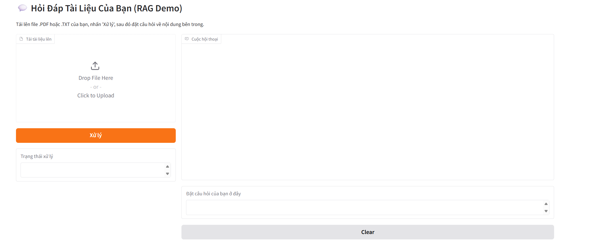

# 💬 Hệ thống Hỏi-Đáp Tài liệu Tiếng Việt sử dụng RAG

Dự án này là một ứng dụng web cho phép người dùng tải lên tài liệu (`.pdf`, `.txt`) và đặt câu hỏi về nội dung của tài liệu đó bằng ngôn ngữ tự nhiên. Hệ thống sử dụng kỹ thuật Retrieval-Augmented Generation (RAG) để đảm bảo câu trả lời được tạo ra dựa trên thông tin có trong tài liệu, tránh bịa đặt thông tin.

Đây là một dự án cá nhân được xây dựng nhằm mục đích nghiên cứu và thực hành các kỹ thuật tiên tiến trong lĩnh vực Xử lý Ngôn ngữ Tự nhiên (NLP) và Mô hình Ngôn ngữ Lớn (LLMs).

## ✨ Tính năng chính

* **Tải lên tài liệu:** Hỗ trợ các định dạng file `.pdf` và `.txt`.
* **Giao diện Chat:** Giao diện trò chuyện trực quan và thân thiện, cho phép hỏi-đáp liên tục.
* **Tìm kiếm ngữ nghĩa:** Sử dụng mô hình embedding để tìm kiếm các đoạn văn bản liên quan nhất đến câu hỏi của người dùng.
* **Tạo sinh câu trả lời:** Dùng một Mô hình Ngôn ngữ Lớn để tạo ra câu trả lời dựa trên thông tin đã tìm được.
* **Ngăn chặn bịa đặt (Hallucination):** Câu trả lời được giới hạn trong phạm vi kiến thức của tài liệu được cung cấp.

## 🚀 Demo



*Hướng dẫn: Em hãy chạy ứng dụng, chụp một bức ảnh đẹp hoặc dùng các công cụ như ScreenToGif để quay lại cảnh em tải file lên và đặt câu hỏi. Sau đó, kéo thả file ảnh/gif đó vào phần "Issues" hoặc bất kỳ đâu trong repository GitHub, GitHub sẽ tự tạo một đường link ảnh cho em để dán vào đây.*

## 🛠️ Công nghệ sử dụng

Dự án này được xây dựng bằng các công nghệ và thư viện hàng đầu trong lĩnh vực AI:

* **Ngôn ngữ:** Python 3.10+
* **Framework AI/ML:** LangChain, PyTorch, Hugging Face Transformers
* **Vector Database:** FAISS
* **Mô hình Embedding:** `bkai-foundation-models/vietnamese-bi-encoder`
* **Mô hình LLM:** `google/flan-t5-small` (phiên bản cơ sở)
* **Giao diện Web:** Gradio

## ⚙️ Cài đặt và Chạy dự án

### 1. Clone Repository

```bash
git clone [https://github.com/QuocHiep123/project_1.git](https://github.com/QuocHiep123/project_1.git)
cd project_1
```
### 2. Tạo môi trường ảo (khuyến khích)

```bash

python -m venv .venv
# Kích hoạt môi trường ảo
# Trên Windows:
.\.venv\Scripts\activate

# Trên macOS/Linux:
source .venv/bin/activate
```

### 3. Cài đặt các thư viện cần thiêt
```bash
pip install -r requirements.txt
```

### 4. Chạy ứng dụng
```bash
python -m app.app
```
